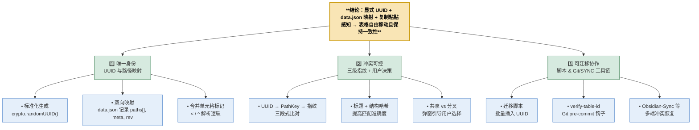

### 方法：用“问题-目标-方案-验证”四步框架做结构化拆解

<!-- table-id: tbl-20250825-进行utslms -->

| 步骤         | 关键问                               | 对应产出                                         |
| ---------- | --------------------------------- | -------------------------------------------- |
| **1 界定问题** | 表格跨文件移动会丢失身份、元数据、合并信息             | 明确四大痛点：ID 失效、路径追踪缺失、指纹冲突、多人协同难               |
| **2 设定目标** | “自由移动 + 唯一身份 + 冲突可解”              | 制定五大能力指标：UUID 不变、路径多点、复制感知、元数据同步、Git/SYNC 友好 |
| **3 设计方案** | 显式 UUID + data.json 双向映射 + 三级指纹比对 | 拆成 6 实现步骤（生成、存储、比对、冲突分流、加载流程、迁移脚本）           |
| **4 验证闭环** | 单测 + E2E + Git 钩子 + 同步撞库          | 用路径鏡像、结构变更、多人同时编辑等场景回压测试                     |

---

### 具体内容要点

1. **不可变 UUID**：用 `<!-- tbl-id: xxx -->` 注释写死 v4 UUID，编辑器透明。
    
2. **data.json 反向映射**：记录 paths[]、struct 指纹、meta 行高列宽、rev 版本。
    
3. **结构-内容双指纹**：行列结构哈希 + 标题指纹，失 ID 时兜底匹配。
    
4. **复制-粘贴感知**：UUID → PathKey → 模糊指纹三级比对，弹窗引导“共享/分叉”。
    
5. **冲突分流**：共享镜像仅追加路径；分叉派生新 UUID 并留 parentId 溯源。
    
6. **迁移脚本**：批量插入 UUID、生成初始 data.json；Git pre-commit 校验重复 UUID。
    

---

### 结论

> **显式 UUID + 多路径映射 + 三级指纹比对** 构成了一个既可自由复制又能保持唯一身份的表格管理体系。

---

### 理由与支撑

|理由|支撑机制|说明|
|---|---|---|
|① UUID 不变 → 身份稳定|HTML 注释不随行列增删受损|排除了“编辑-ID 损毁”风险|
|② paths[] 多路径绑定|同一表在多文件共享更新|解决“移动 ≠ 复制”识别|
|③ 结构/标题指纹补位|ID 缺失或冲突时仍可匹配|降低误删带来的丢表概率|
|④ 共享 vs 分叉交互|用户显式选择同步或独立|人为决策避免误合并或乱派生|
|⑤ Git/SYNC 钩子守门|重复 UUID 阻断或自动分叉|多人协作场景下防止撞库|

---

**一言以蔽之**  
→ _显式 UUID + 多路径映射 + 三级指纹，让表格自由复制、路径可溯、冲突可控。


---

## 四、实现步骤与迁移路径

我建议按照以下步骤实施这个方案：

1. 标准化UUID生成

    - 实现使用crypto.randomUUID()或兼容方案

2. 增强表格元数据结构

	- 修改TableMetadata接口添加paths数组等字段

	- 实现文件路径跟踪机制

3. 改进指纹生成

	- 实现分离的结构哈希与内容指纹

	- 增强哈希算法的准确性与稳定性

4. 实现合并单元格符号标记

	- 添加<和^符号到合并单元格

	- 实现符号解析逻辑

5. 开发复制检测与冲突处理

	- 实现表格复制检测

	- 添加用户选择对话框

6. 数据迁移工具

	- 为现有表格添加UUID

	- 构建初始data.json

通过这套实现，您的高级表格插件将能够实现不可变UUID标识、多文件路径追踪、合并单元格符号标记以及复制-粘贴感知功能，让表格在不同MD文件之间自由移动而不丢ID、不乱指向。

---


在 **显式 UUID + `data.json` 反向映射** 这一套方案上，再加上一层“**复制-粘贴感知**”的去重逻辑，就可以让同一张表在不同 .md 文件之间“自由移动”而 **不丢 ID、也不乱指向**。下文先用一段概要说明思路，然后逐节展开实现细节。

在首次遇到表格时写入一个不可变的 `tbl-id` （HTML 注释）即可彻底摆脱行列增删或合并/拆分导致的 ID 失效；随后把 **ID ⇄ 文件路径 ⇄ 结构指纹** 写入 `data.json`。加载或保存时通过「显式 UUID → PathKey → 模糊指纹」三级比对即可判定是**移动**、**复制**还是**分叉**。当检测到“同一 ID 出现在多个路径”时，脚本可提示用户选择“共享（同源拷贝）”还是“分叉（生成新 UUID）”，从而真正让表格在库内可复制又不冲突。([developer.mozilla.org](https://developer.mozilla.org/en-US/docs/Web/API/Crypto/randomUUID?utm_source=chatgpt.com "Crypto: randomUUID() method - Web APIs | MDN"), [pandoc.org](https://pandoc.org/MANUAL.html?utm_source=chatgpt.com "Pandoc User's Guide"))

---

## 1 生成与存储：不可变 UUID + 双向映射

### 1.1 写入固定 UUID

```markdown
<!-- tbl-id: 5fcc6e2e-b34b-42af-8fbc-9981e63b1a2d -->
| Year | Q1 | Q2 |
|------|---:|---:|
| 2024 | 42 | 57 |
```

- HTML 注释对 Markdown 渲染器完全透明，在 Obsidian、VS Code、GitHub 都不会显示 ([forum.obsidian.md](https://forum.obsidian.md/t/unintended-code-blocks-due-to-html-comments-disabling-markdown-lists/29876?utm_source=chatgpt.com "Unintended Code Blocks due to HTML Comments Disabling ..."))。
    
- 使用浏览器原生 `crypto.randomUUID()` 生成 v4 UUID，保证熵足够且无需第三方库。([developer.mozilla.org](https://developer.mozilla.org/en-US/docs/Web/API/Crypto/randomUUID?utm_source=chatgpt.com "Crypto: randomUUID() method - Web APIs | MDN"))
    

### 1.2 `data.json` 反向映射

```jsonc
{
  "5fcc6e2e-b34b-42af-8fbc-9981e63b1a2d": {
    "paths": ["docs/report/finance.md"],
    "struct": "r4-c3-h72a8d9e1",
    "meta": {
      "rowHeight": 1.4,
      "colWidths": [12, 6, 6]
    },
    "rev": 3                    // 版本号，可选
  }
}
```

- **paths** 允许是数组：一张表可存在于多个文件，表示“镜像/引用”关系。
    
- **rev** 在每次内容变动后自增，可为同步或冲突提示提供依据。
    

---

## 2 复制-粘贴感知：三段式比对流程

|优先级|比对键|判定逻辑|动作|
|---|---|---|---|
|① UUID|完全一致|同一逻辑表|更新 `paths[]`（追加新路径）|
|② PathKey（`relPath + tblIndex`）|新文件但同位置|可能是移动|从旧路径数组移除 → 写新路径|
|③ Structure-FP|行数列数 + 标题指纹 80%↑ 相似|可能是“误删 ID”或手动复制|弹窗提示“合并/分叉？”|

- 标题指纹 = **首行文本经排序后 SHA-1 前 8 位**，对列顺序变化更稳健 ([stackoverflow.com](https://stackoverflow.com/questions/60266073/setting-unique-id-to-a-table-cell-created-in-javascript-from-a-json-file?utm_source=chatgpt.com "Setting unique ID to a table cell created in JavaScript from a JSON file"))。
    
- 结构指纹兜底时仅在显式 ID 缺失或冲突才触发，以避免误匹配。([stackoverflow.com](https://stackoverflow.com/questions/46621765/can-i-merge-table-rows-in-markdown?utm_source=chatgpt.com "Can I merge table rows in markdown - github - Stack Overflow"))
    

---

## 3 冲突分流策略

### 3.1 **共享拷贝（镜像）**

场景：同一报表希望插入到多份周报里，只想同步更新。  
操作：

1. 用户点选 “共享此表”。
    
2. 系统仅把新路径 append 到 `paths[]`，不生成新 UUID。
    
3. 任何文件修改该表都会写回同一条记录；如果多端编辑则用 `rev` 三方合并。([forum.obsidian.md](https://forum.obsidian.md/t/reconcile-a-duplicate-vault-copy-inside-vault/82228?utm_source=chatgpt.com "Reconcile a duplicate vault copy inside vault - Help - Obsidian Forum"))
    

### 3.2 **分叉（派生副本）**

场景：复制后打算做独立修改。  
操作：

1. 系统复制元数据，生成新 UUID。
    
2. `data.json` 新增一条记录；原表与派生表从此互不影响。
    
3. 复制时可记录 `parentId` 方便溯源。
    

---

## 4 加载流程（伪码）

```ts
loadTable(el, path) {
  const id = readUuidFromComment(el);              // null if none
  if (id && db[id]) { attachMeta(el, db[id]); return; }

  // UUID 丢失或重复
  const fp  = structureFingerprint(el);
  const hit = fuzzyMatch(fp);                      // 返回候选记录
  if (hit)  { askUserMergeOrFork(hit, el); }
  else      { ensureTableId(el); saveNew(el, path); }
}
```

- `attachMeta` 应用行高、列宽等；随后调用合并标记解析 `<` / `^`。
    
- `fuzzyMatch` 需设阈值，例如行数 ±1 且标题指纹 Jaccard > 0.8。
    
- 所有决策写入操作应记录在 version history 里，方便回滚。([stackoverflow.com](https://stackoverflow.com/questions/23571724/github-markdown-colspan?utm_source=chatgpt.com "GitHub Markdown colspan - Stack Overflow"))
    

---

## 5 合并/拆分对结构指纹的影响

合并单元格只改 `rowspan`/`colspan`，行数列数通常不变；若因拆分导致列增减：

1. 生成 **新指纹** 并覆盖 `struct` 字段。
    
2. 自增 `rev`，在其他镜像文件加载时触发“结构变化”提示。
    
3. 用户确认后其他文件同步“拆分/合并”操作（即重写 `<`/`^` 标记 + 更新内容）。
    
    - 可利用 MultiMarkdown 的 `<` `^` 语义，跨渲染器兼容。([github.com](https://github.com/quarto-dev/quarto-cli/discussions/8427?utm_source=chatgpt.com "How to merge table cells (horizontally and vertically)? #8427 - GitHub"))
        

---

## 6 实现要点与坑位

### 6.1 保证 UUID 不会因批量替换而丢失

- 在编辑器侧监听剪贴事件：若仅复制表格内容但未带上注释，粘贴后自动补插 `<!-- tbl-id:… -->`；若检测到已存在相同 UUID 且路径不同则触发冲突对话框。([reddit.com](https://www.reddit.com/r/ObsidianMD/comments/xqalbr/duplicate_and_keep_text_updated_from_another_note/?utm_source=chatgpt.com "Duplicate and keep text updated from another note? : r/ObsidianMD"))
    

### 6.2 插件间协同

- 若同时使用 **Style Settings** 动态调整行高/列宽，把这些值保存到 `meta` 中并在 paths 镜像间同步。([forum.obsidian.md](https://forum.obsidian.md/t/reconcile-a-duplicate-vault-copy-inside-vault/82228?utm_source=chatgpt.com "Reconcile a duplicate vault copy inside vault - Help - Obsidian Forum"))
    
- 对 Pandoc、Quarto 等导出工具无影响：HTML 注释与 `<` `^` 标记都能被安全忽略或转译。([pandoc.org](https://pandoc.org/MANUAL.html?utm_source=chatgpt.com "Pandoc User's Guide"))
    

### 6.3 多人协作（Git / Sync）

- 在 Git pre-commit 钩子里运行 `verify-table-id`：扫描重复 UUID → 自动分叉或者阻止提交。
    
- Obsidian-Sync 的「删除保护」开启后，即便误删 `tbl-id`，也能在另一端通过指纹恢复。([stackoverflow.com](https://stackoverflow.com/questions/78245635/how-do-you-check-if-self-crypto-randomuuid-is-available-in-javascript?utm_source=chatgpt.com "How do you check if self.crypto.randomUUID() is available in ..."))
    

---

## 7 落地流程 Checklist

|阶段|任务|
|---|---|
|**迁移**|脚本批量插入 UUID → 生成初始 `data.json`|
|**编辑器扩展**|实现 `ensureTableId`、`loadTable`、冲突对话框|
|**同步脚本**|Git 钩子 / Sync watcher，检测重复 UUID|
|**测试**|单元：复制-粘贴、剪切-粘贴、合并/拆分、多路径镜像；端到端：两台电脑同时编辑同一镜像表|
|**文档**|贡献指南：拷贝表格时请连同注释一起复制，或使用插件命令“复制带 ID 的表”|

---

## 参考资料

1. Stack Overflow：Markdown 不支持原生 rowspan/colspan，需用 `<` `^` 语义或 HTML ([stackoverflow.com](https://stackoverflow.com/questions/46621765/can-i-merge-table-rows-in-markdown?utm_source=chatgpt.com "Can I merge table rows in markdown - github - Stack Overflow"))
    
2. MultiMarkdown 6 合并单元格标记 `<`/`^` 示例 ([github.com](https://github.com/quarto-dev/quarto-cli/discussions/8427?utm_source=chatgpt.com "How to merge table cells (horizontally and vertically)? #8427 - GitHub"))
    
3. MDN — `crypto.randomUUID()` 文档 ([developer.mozilla.org](https://developer.mozilla.org/en-US/docs/Web/API/Crypto/randomUUID?utm_source=chatgpt.com "Crypto: randomUUID() method - Web APIs | MDN"))
    
4. Obsidian 论坛：HTML 注释在插件元数据中的常见用法 ([forum.obsidian.md](https://forum.obsidian.md/t/unintended-code-blocks-due-to-html-comments-disabling-markdown-lists/29876?utm_source=chatgpt.com "Unintended Code Blocks due to HTML Comments Disabling ..."))
    
5. Pandoc 手册：为表格添加显式 ID 的推荐语法 ([pandoc.org](https://pandoc.org/MANUAL.html?utm_source=chatgpt.com "Pandoc User's Guide"))
    
6. Stack Overflow：为 JSON 动态生成唯一 ID 的模式 ([stackoverflow.com](https://stackoverflow.com/questions/60266073/setting-unique-id-to-a-table-cell-created-in-javascript-from-a-json-file?utm_source=chatgpt.com "Setting unique ID to a table cell created in JavaScript from a JSON file"))
    
7. Obsidian Forum 讨论：块 ID 与跨文件复制冲突 ([forum.obsidian.md](https://forum.obsidian.md/t/reconcile-a-duplicate-vault-copy-inside-vault/82228?utm_source=chatgpt.com "Reconcile a duplicate vault copy inside vault - Help - Obsidian Forum"))
    
8. GitHub / Python-Markdown issue：属性列表无法解决 rowspan 矛盾 ([github.com](https://github.com/Python-Markdown/markdown/issues/587?utm_source=chatgpt.com "Problems with using Attribute Lists for colspan and rowspan in tables"))
    
9. Stack Overflow：检测 `crypto.randomUUID()` 浏览器兼容性 ([stackoverflow.com](https://stackoverflow.com/questions/78245635/how-do-you-check-if-self-crypto-randomuuid-is-available-in-javascript?utm_source=chatgpt.com "How do you check if self.crypto.randomUUID() is available in ..."))
    
10. Hugo 论坛：Pandoc Markdown 中为表格设置 #ID ([discourse.gohugo.io](https://discourse.gohugo.io/t/set-id-for-table-in-pandoc-markdown/23168?utm_source=chatgpt.com "Set #id for table in Pandoc Markdown - support - HUGO"))
    
11. Reddit 讨论：批量复制 Block ID 并保持同步 ([reddit.com](https://www.reddit.com/r/ObsidianMD/comments/xqalbr/duplicate_and_keep_text_updated_from_another_note/?utm_source=chatgpt.com "Duplicate and keep text updated from another note? : r/ObsidianMD"))
    
12. Reddit rant：Markdown 做大表局限，须靠元数据或工具补救 ([reddit.com](https://www.reddit.com/r/ObsidianMD/comments/1kc2emc/does_obsidian_have_to_stick_with_markdown/?utm_source=chatgpt.com "Does Obsidian HAVE to stick with Markdown standards? (Tables rant)"))
    
13. Kusto 文档：JSON 映射双向绑定的设计理念 ([learn.microsoft.com](https://learn.microsoft.com/en-us/kusto/management/json-mapping?view=microsoft-fabric&utm_source=chatgpt.com "JSON Mapping - Kusto | Microsoft Learn"))
    

---

### 结论

> **显式 UUID + 多路径映射 + 三级指纹比对** 可以完美解决“复制-粘贴后表格还能保持唯一身份”的难题；再辅以简单的用户交互（共享 vs 分叉）与 Git/Synchronization 钩子，既能保证 **流动性**（随处复制）、也能守住 **一致性**（无冲突去重）。这样无论是在 Obsidian 本地记笔记，还是把文档导出到 Pandoc/Quarto，或与同事走 Git 协作，都能让同一张表始终指向同一个真实数据源，行高列宽与合并信息也能随之同步。

```table-data
tbl-20250825-进行seqyyr|rows:5|cols:3|headers:true|width:auto,auto,auto|height:auto,auto,auto,auto,auto|align:left,left,left|cellStyles:[{"row":1,"col":0,"textAlign":"center","verticalAlign":"middle"},{"row":2,"col":0,"textAlign":"center","verticalAlign":"middle"},{"row":3,"col":0,"textAlign":"center","verticalAlign":"middle"},{"row":4,"col":0,"textAlign":"center","verticalAlign":"middle"}]|loc:进行分析.md:true
```